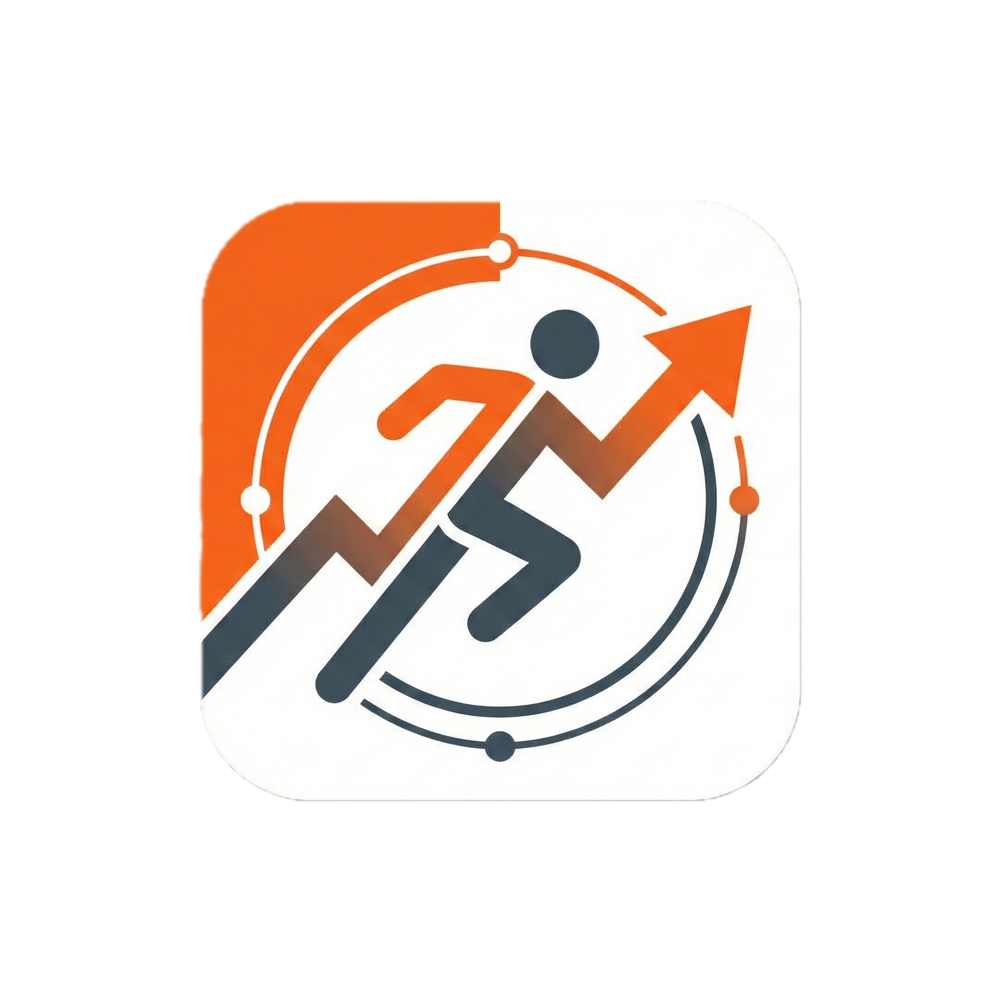
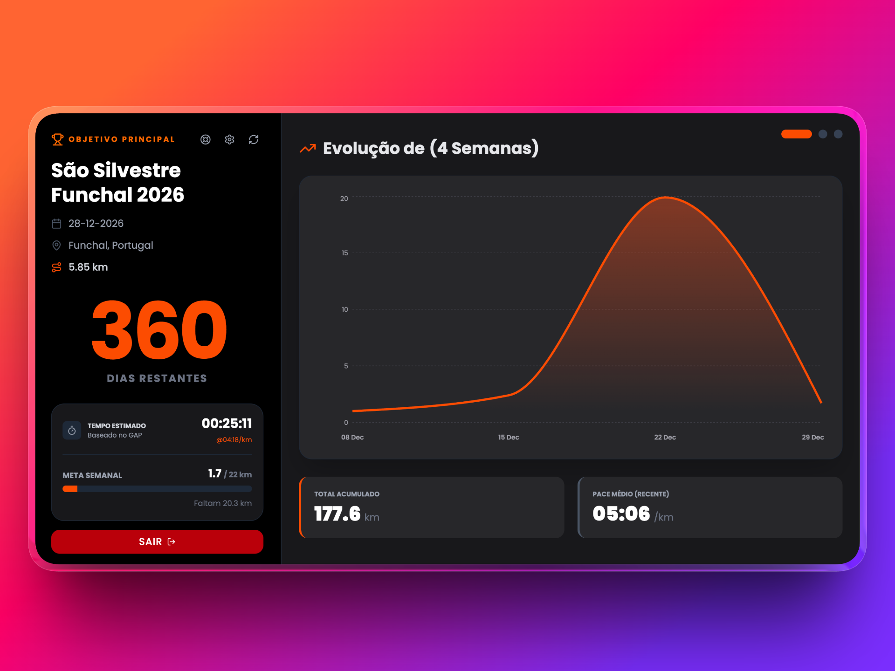
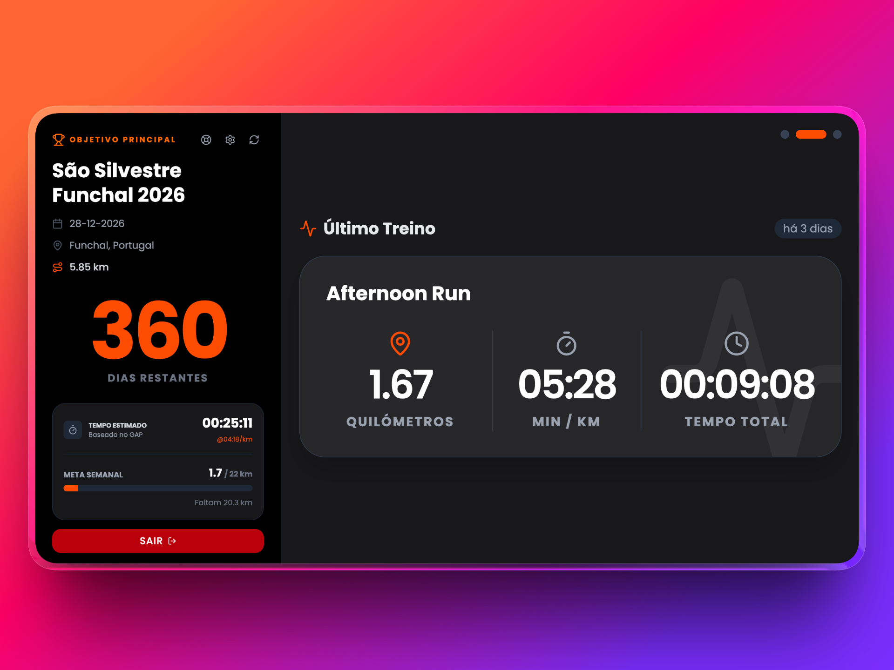
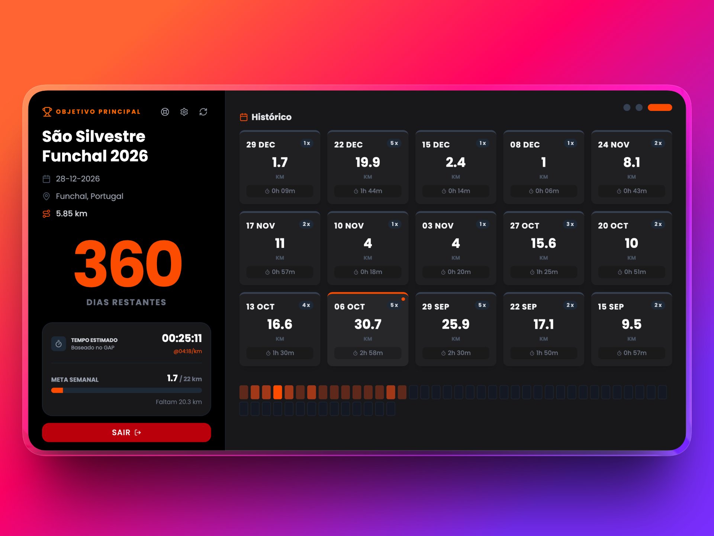

<p align="center">
  
</p>

<h1 align="center">Run Tracker</h1>

<p align="center">
  A Smart Running Dashboard designed for "TV Mode", focused on goal tracking and performance prediction.
</p>

<p align="center">
  <a href="https://runtracker.vitorvieiradev.com"><strong>🌐 View Live Demo (runtracker.vitorvieiradev.com)</strong></a>
</p>

<p align="center">
  
  
  
</p>

---

## 🚧 Project Status: Private Beta

**Run Tracker** is a platform currently under active development, created to fill a gap in running data visualization for performance-focused athletes.

* **Current Phase:** The project is in **Closed Beta**. Access is currently restricted due to Strava API rate limits while we await official application verification.
* **Roadmap:** The goal is to evolve the platform into a **SaaS (Software as a Service)** model, allowing multiple athletes to track their goals in real-time.
* **Integration:** Fully integrated with Strava API v3 (activity synchronization, token management, and webhooks).

---

## 🏃 What is Run Tracker?

Run Tracker transforms raw Strava data into a "Big Screen" visual experience. Designed to run on TVs or secondary monitors, it acts as a **"hands-off" motivation hub**, automatically cycling through crucial metrics without requiring user interaction.

Unlike deep technical analysis apps (like TrainingPeaks), Run Tracker focuses on **progress visualization and goal gamification**.

## ✨ Key Features

### 📺 TV Dashboard (Auto Carousel)
* **Slide 1 - Volume Evolution:** Dynamic area chart showing training volume over the last 4 weeks.
* **Slide 2 - Last Run Spotlight:** High-impact visualization with Pace, Time, Distance, and **Watts** (Power) metrics.
* **Slide 3 - Annual Consistency:** GitHub-style heat grid to visualize training frequency throughout the year.
* **Interactivity:** The carousel runs automatically but supports navigation via scroll (desktop) or swipe (mobile).

### 🤖 Smart Race Predictor
* **Adaptive Algorithm:** Uses the Riegel Formula based on GAP (Grade Adjusted Pace) to estimate race times.
* **Smart Filtering:** Automatically ignores recovery runs and warm-ups, focusing only on recent "Best Efforts" to generate realistic predictions.

### 🎯 Goal Management
* **Race Countdown:** Dynamic countdown to the target race day.
* **Weekly Tracker:** Real-time progress bar (Km run vs. Weekly Goal).
* **Multi-Distance Support:** Adjusted predictions for Marathon, Half-Marathon, 10k, etc.

### 🛠️ Tech Stack

The platform was built with a focus on performance, scalability, and modern UX.

* **Backend:** Laravel 1 (PHP) with Queues for asynchronous processing.
* **Frontend:** React.js rendered via Inertia.js.
* **Database:** MySQL.
* **Design:** Tailwind CSS (Native Dark Mode).
* **Charts:** Recharts.
* **Integrations:** Strava API, Discord Webhooks (Support/Ticket System).

---

## 📸 Screenshots

Here are the three main Dashboard modes:

<div align="center">
  <h3>1. Volume & Evolution (TV Mode)</h3>
  
  <br><br>

  <h3>2. Last Run Spotlight</h3>
  
  <br><br>

  <h3>3. Consistency History (Heatmap)</h3>
  
</div>

---

## ⚙️ Installation (For Technical Review Only)

This source code is made available for technical competency demonstration and portfolio purposes.

1.  **Clone the repository**
    ```bash
    git clone https://github.com/VitorVieira20/StravaTracker.git
    ```
2.  **Install dependencies**
    ```bash
    composer install && npm install
    ```
3.  **Configure Environment Variables (.env)**
    ```env
    STRAVA_CLIENT_ID=your_id
    STRAVA_CLIENT_SECRET=your_secret
    DISCORD_WEBHOOK_URL=your_webhook
    ```
4.  **Run**
    ```bash
    php artisan serve
    npm run dev
    php artisan queue:work
    ```

---

## 🔒 Copyright and License

**© 2024-2026 Vítor Vieira. All rights reserved.**

This project is proprietary software. The source code is publicly available solely for educational and personal portfolio purposes.

* 🚫 **Prohibited:** Copying, redistributing, selling, or using this code to create a competing or commercial service.
* 🚫 **Prohibited:** Hosting this code publicly as a SaaS service without express permission from the author.
* ✅ **Permitted:** Studying the code for learning or technical reference.

For inquiries regarding commercial licensing or partnerships, please contact via the official website.

---
<p align="center">
  Made with ❤️ and 🏃 by <a href="https://vitorvieiradev.com">Vítor Vieira</a>
</p>